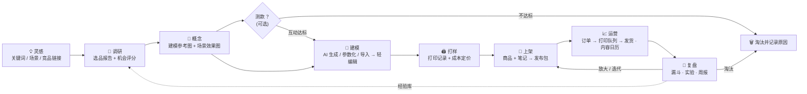

# 02 · 用户旅程与信息架构

> 状态：v0.1 设计稿（2026-09-20）· 低保真线框，用来对齐结构与关键交互，不约束视觉。

## 1. 主旅程：一个单品的一生



每个阶段都有**阶段门**（进入条件 / 必备产出 / 通过标准 / 淘汰标准），定义见 [01-prd.md](01-prd.md) §4。看板上卡片能否拖到下一列，由阶段门清单决定；未满足时可以强行推进，但要填原因——保证速度，同时留下复盘线索。

## 2. 信息架构

```
PrintPilot
├─ 工作台              今日待办 · 北极星与漏斗速览 · 进行中的 AI 任务 · 预算消耗
├─ 项目
│  ├─ 看板 / 列表      按阶段分列；筛选：品类、渠道、状态
│  └─ 项目详情
│     ├─ 概览          阶段条 + 阶段门清单 · 假设 · 关键数字 · 活动流
│     ├─ 调研          报告 · 机会卡片 · 证据卡 · 追问
│     ├─ 预览图        建模参考图 / 场景效果图 / 封面 · 提示词 · 版本
│     ├─ 3D 模型       版本列表 → 进入 3D 工作室
│     ├─ 打样与成本    打印记录 · 成本模型 · 定价建议
│     ├─ 上架与内容    商品草稿 · 笔记草稿（多角度/多变体）· 合规检查 · 发布包
│     ├─ 订单          本单品订单 · 定制信息
│     ├─ 数据与实验    漏斗 · 指标快照 · 实验 · AI 诊断
│     └─ 资产          全部文件与血缘
├─ 灵感池              调研任务 · 机会卡片 · 趋势雷达(V1)
├─ 内容日历            计划 / 已发布 · 录数提醒（T+1 / T+3 / T+7）
├─ 订单与打印队列      待打印 → 打印中 → 后处理 → 已打包 → 已发货 · 产能与交期
├─ 数据                总漏斗 · 单品对比 · 实验列表 · 经验库
└─ 设置                模型与密钥 · 打印机与耗材 · 成本参数 · 渠道 · 预算 · 品牌语气 · 违禁词库
```

## 3. 关键界面线框

### 3.1 项目看板

```
┌ 项目 ─────────────────────────────────────────────── [+ 新建项目] [看板|列表] ┐
│ 调研(2)      概念(3)       建模(1)       打样(2)       上架(1)      运营(4)   │
│ ┌─────────┐ ┌──────────┐ ┌──────────┐ ┌──────────┐ ┌─────────┐ ┌──────────┐ │
│ │PP-0014  │ │PP-0012   │ │PP-0009   │ │PP-0007   │ │PP-0005  │ │PP-0003   │ │
│ │猫爪杯垫 │ │[缩略图]  │ │[3D缩略]  │ │[实拍]    │ │[封面]   │ │[封面]    │ │
│ │评分 3.9 │ │桌面线缆夹│ │月球小夜灯│ │定制铭牌  │ │关节小龙 │ │螺旋笔筒  │ │
│ │⏳调研中 │ │测款中 T+2│ │⚠ 非流形  │ │成本¥18.4 │ │发布包✓  │ │CVR 3.1%  │ │
│ │         │ │已停留 3天│ │          │ │建议¥39.9 │ │待回填链接│ │本周 12 单│ │
│ └─────────┘ └──────────┘ └──────────┘ └──────────┘ └─────────┘ └──────────┘ │
└──────────────────────────────────────────────────────────────────────────────┘
```

卡片上永远显示「这一阶段最该看的一个数」和「卡住的原因」；「已停留 N 天」超阈值变色——速度是第一指标。

### 3.2 项目详情（概览）

```
┌ PP-0012 桌面线缆夹 ──────────────────────────────────────── [暂停] [淘汰] ┐
│ ●调研 ─ ●概念 ─ ○建模 ─ ○打样 ─ ○上架 ─ ○运营 ─ ○复盘      想法→上架 已用 2.5 天 │
├───────────────────────────────────────────────┬──────────────────────────┤
│ 假设：桌搭人群愿为「磁吸+好看」的线缆夹付 ¥25+ │ AI 助手                   │
│                                               │ ┌──────────────────────┐ │
│ 阶段门 · 概念 → 建模                          │ │ 参考图 #3 最适合图生 3D│ │
│ ☑ 已采用 1 张建模参考图                       │ │ （白底、轮廓清晰）。   │ │
│ ☑ 已生成 ≥2 张场景效果图                      │ │ 要我据此提交建模吗？   │ │
│ ☐ 测款（可选）：收藏率 ≥ 5%  当前 3.2% (T+2)  │ │ [提交建模] [先不]      │ │
│                         [进入下一阶段 →]      │ └──────────────────────┘ │
│ 关键数字                                      │ 进行中的任务              │
│ AI 花费 ¥2.31 · 预估成本 — · 预估售价 ¥25~35  │ ◐ 场景图 ×4  00:21        │
├───────────────────────────────────────────────┴──────────────────────────┤
│ 活动流：09-20 14:02 采用了参考图 #3 · 13:40 生成 4 张参考图 (¥0.10) · ……    │
└──────────────────────────────────────────────────────────────────────────┘
```

### 3.3 调研报告

```
┌ 调研：桌面收纳 × 3D 打印 ─────────────── 花费 ¥0.42 · 12 次检索 · 7 篇阅读 ┐
│ 机会卡片（按总分）                                                        │
│ ┌────────────────────────┐ ┌────────────────────────┐ ┌─────────────────┐ │
│ │ 磁吸线缆夹        4.1  │ │ 模块化笔筒        3.6  │ │ 显示器增高架 2.4│ │
│ │ 需求●●●●○ 竞争●●○○○    │ │ 需求●●●○○ 竞争●●●○○    │ │ ⚠ 尺寸超成型范围│ │
│ │ 可打印●●●●● 毛利●●●●○  │ │ ……                     │ │                 │ │
│ │ 价格带 ¥19~39 · IP 低  │ │                        │ │                 │ │
│ │ [采用为项目] [看证据]  │ │ [采用为项目]           │ │ [忽略]          │ │
│ └────────────────────────┘ └────────────────────────┘ └─────────────────┘ │
│ 报告正文（带引用 [1][2]…；「推测」类结论灰色标注）                        │
│ 证据卡：[1] 某帖 · 2026-08 · B 级 · “……摘录……”  ↗                        │
│ [+ 补充证据：粘贴竞品链接 / 上传截图]                 [追问这份报告…]     │
└──────────────────────────────────────────────────────────────────────────┘
```

### 3.4 预览图

> **0.9.2 起的实际形态**见文末「附：图片工作台」——出图不再是下面这张表单,而是一条和 AI 的对话([ADR-0005](adr/0005-image-studio.md))。下面的线框保留作最初设想的记录。

```
┌ 预览图 ── 用途：(●建模参考图) (○场景效果图) (○笔记封面) ───────────────────┐
│ 概念简述（来自机会卡片，可改）：磁吸线缆夹，圆润几何，哑光 PLA 质感……      │
│ 风格：[极简] [可爱] [机能]   配色：[奶白] [雾蓝]   比例：1:1   数量：4     │
│ 提示词（AI 已起草，可编辑）▸                              [生成 · 约 ¥0.10]│
├──────────────────────────────────────────────────────────────────────────┤
│ ┌──────┐ ┌──────┐ ┌──────┐ ┌──────┐                                      │
│ │  #1  │ │  #2  │ │ #3 ★ │ │  #4  │   ★ = 已采用为建模参考                │
│ └──────┘ └──────┘ └──────┘ └──────┘   [采用] [以此为基础再生成] [送去建模]│
│ 图生 3D 友好度自检：☑ 单一物体 ☑ 纯色背景 ☑ 无遮挡 ☐ 无透明/镂空细节       │
└──────────────────────────────────────────────────────────────────────────┘
```

三种用途用三套提示词策略：**建模参考图**追求几何清晰（白底、单物体、3/4 视角）；**场景效果图**追求氛围（用于测款与种草）；**笔记封面**由模板叠字生成（文字不交给 AI 画，保证清晰可控）。

### 3.5 3D 工作室

```
┌ 3D 工作室 · PP-0012 · v3 ─────────────────────── [保存为新版本] [导出 ▾] ┐
│ 工具          │                                         │ 模型信息        │
│ ⤢ 缩放到尺寸  │          ┌───────────────┐              │ 62 × 40 × 28 mm │
│ ⟳ 摆正/贴床   │          │   (3D 视口)   │              │ 体积 21.4 cm³   │
│ ▭ 切平底      │          │  含打印机成型 │              │ 面数 182k       │
│ ⇋ 镜像        │          │  范围参考框   │              │ 水密 ✓ 流形 ✓   │
│ — V1 —        │          └───────────────┘              │ 预估 27 g · 1h40│
│ 🔧 一键修复   │  视图：[实体] [线框] [悬垂热力(V1)]      │                 │
│ ✎ 文字浮雕/刻 │                                         │ 可打印性清单    │
│ ◫ 分件        │                                         │ ☑ 在成型范围内  │
│ ▽ 减面        │                                         │ ☑ 底面平整      │
│               │                                         │ ☐ 最小壁厚≥1mm  │
│               │                                         │ ☐ 悬垂已评估    │
│ [在切片软件中打开]                                       │ [通过，去打样 →]│
└──────────────────────────────────────────────────────────────────────────┘
```

### 3.6 成本与定价

```
┌ 成本与定价 ──────────────────────────────────────────────────────────────┐
│ 材料  27 g × ¥0.07/g × (1+5% 损耗) ÷ 92% 成功率 ……………… ¥2.16             │
│ 电费+折旧  1.7 h ÷ 92% × (¥0.06 + ¥0.60)/h ………………………… ¥1.22             │
│ 人工  后处理+打包 8 min × ¥0.5/min …………………………………… ¥4.00             │
│ 包装 ¥1.20 · 运费补贴 ¥4.50 ……………………………………………… ¥5.70             │
│ ─────────────────────────────────────────────────────────                │
│ 单位成本 ¥13.08        平台费率 5%（可改）                                │
│ 建议售价  [¥29.9  毛利 51%]  [¥39.9  毛利 62%]  [¥45.9  毛利 67%]          │
│ 竞品价格带 ¥19~39（来自调研）  ▁▃▇▅▂   你的位置 ▲                         │
│ 产能：单机约 12 件/天 → 日接单上限 12 · 承诺发货时效建议 48h               │
└──────────────────────────────────────────────────────────────────────────┘
```

**实际形态（0.9.4，[ADR-0007](adr/0007-cost-pricing.md)）**：侧栏一级入口「定价」，三栏——左：项目列表（已定价的有标记）；中：成本参数分五组（这一件 / 机器与耗材 / 人工与杂费 / 渠道 / 产能），「按名下模型估算」「用最近一次成功打样的实际值」两个一键带入；右：成本拆解 → 三档建议价 + 自己填价 → 这个价下的三个数（毛利率、每件毛利、每机时毛利）和提醒 → 竞品价格带上「你的位置」→ 产能 → 打样记录（成功 / 失败、实际克数与时长、失败原因必填）。右上角「打印机 · 耗材 · 默认值」管理档案。改任何一个数右边立刻重算，停手半秒自动保存。

### 3.7 上架与发布包

```
┌ 上架与内容 · 渠道：小红书 ────────────────────────────────────────────────┐
│ 笔记草稿   角度：[痛点型 ★] [场景型] [过程型(打印延时)] [定制故事型]       │
│ 标题（≤20 字）  桌面乱线终结者｜磁吸线缆夹                      14/20      │
│ 正文 ▸ ……                                                     312/1000    │
│ 话题  #桌搭 #3D打印 #线缆收纳 ……                                          │
│ 封面  [A 实拍+大字] [B 前后对比]   ← 两个变体将进入实验                   │
│ 合规检查  ✓ 无极限词  ✓ 无 IP 词  ⚠ 含 AI 生成图：发布时请勾选 AI 内容声明 │
│                                                    [生成发布包]           │
├──────────────────────────────────────────────────────────────────────────┤
│ 发布包   图片 ×6（已按 3:4 处理）· 文案 · 话题 · 商品信息                  │
│                                                                          │
│ 方式 A · 在电脑上发布                  方式 B · 用手机发布                 │
│ [打开素材文件夹] [打开官方创作平台]    ┌─────────┐ 同一 Wi-Fi 下扫码：      │
│ [复制标题] → [复制正文] → [复制话题]   │ QR CODE │ 保存图片 / 一键复制文案  │
│ （复制一项，按钮自动跳到下一项）       └─────────┘ （页面仅在本窗口打开时可用）│
│                                                                          │
│ 状态：待发布 → [我已发布，回填链接 ______ ]                                │
└──────────────────────────────────────────────────────────────────────────┘
```

> 实际做出来的样子见 [ADR-0009](adr/0009-publish-pack.md)：检查在右栏、边打字边出；封面变体（P1）还没有；手机页是三个复制按钮 + 图片列表（长按保存），没有「保存全部图片」——HTTP 的局域网页面在手机浏览器里做不了批量保存。

两种方式都是「人来点发布」：

- **方式 A（电脑）**：应用把图片导出到一个文件夹并打开它，同时在默认浏览器里打开渠道的**官方网页版发布入口**；文案按「标题 → 正文 → 话题」逐项复制，拖图、粘贴、发布。
- **方式 B（手机）**：桌面应用**按需临时开启**一个局域网页面（带一次性令牌，关闭窗口即停止），手机扫码后只有四个大按钮：保存全部图片 / 复制标题 / 复制正文 / 复制话题。首次使用会触发 Windows 防火墙授权提示，界面上提前说明。

目标：**从点开发布包到发布完成 ≤ 2 分钟**。

### 3.8 数据录入（截图 → 指标）

```
┌ 录入数据 · 笔记「桌面乱线终结者」· T+3 ───────────────────────────────────┐
│ [拖入创作者中心 / 店铺后台的数据截图]                                     │
│ 识别结果（请核对）              原图                                      │
│ 曝光      12,480               ┌──────────┐                               │
│ 阅读       1,310  → CTR 10.5%  │ (截图)   │                               │
│ 赞/藏/评   86 / 142 / 23       │          │                               │
│ 商品点击     96                └──────────┘                               │
│ [确认入库]  [手动修改]                                                    │
└──────────────────────────────────────────────────────────────────────────┘
```

没有数据 API 的渠道用「截图 + 视觉模型识别 + 人工确认」把每周录数压到 10 分钟以内；有官方导出的走 CSV；有 API 的自动同步。三种来源落到同一张 `metric_snapshots` 表。

### 3.9 复盘

```
┌ 复盘 · PP-0003 螺旋笔筒 · 上架第 21 天 ───────────────────────────────────┐
│ 漏斗      曝光 48.2k → 阅读 4.1k (8.5%) → 商品访客 610 → 支付 19 (3.1%)   │
│ 对比基线  CTR ▼ 低于自己的中位数 10.2%     CVR ▲ 高于中位数 2.4%          │
│ AI 诊断   流量入口偏弱而承接不错 → 优先换封面/标题，而不是降价            │
│ 建议实验  ① 封面改「前后对比」(ICE 8.0)  ② 标题加搜索词「笔筒 桌搭」(7.2)  │
│ P&L       收入 ¥758 · 材料 ¥96 · 运费 ¥86 · 平台费 ¥38 · AI ¥3.1 → 毛利 ¥535│
│ 决策      (●放大) (○迭代) (○淘汰)      [沉淀为经验 →]                      │
└──────────────────────────────────────────────────────────────────────────┘
```

## 4. 交互规范

| 主题 | 规范 |
|------|------|
| 异步任务 | 点击即出现占位卡片（带预计耗时与费用）；可离开页面；完成后工作台与项目活动流都有提示；失败给出原因与「重试」。 |
| 费用透明 | 每个生成按钮旁显示预估费用；超过预算闸门时按钮置灰并说明原因。 |
| 采用与版本 | AI 产出默认是候选；「采用」后才成为阶段产出；再生成不覆盖旧版本。 |
| 人工确认 | 一切对外内容（标题、正文、价格、回复）发布前必须经人确认；识别类结果（截图解析、订单导入）必须经人核对。 |
| 首次使用 | 三步引导：① 选资料库位置（3D 文件大，允许放到非系统盘）并填打印机与耗材 ② 配置接口密钥——提供「一家搞定 / 性价比组合 / 自定义」三种预设，每把密钥都有「测试连接」，也可以先用演示数据把流程走一遍 ③ 从一个关键词开始第一个项目。 |
| 能力降级 | 某类密钥没配时，对应功能给出明确提示而不是报错：没配搜索 → 调研退化为「用户证据 + 模型知识」并醒目标注；没配 3D → 仍可导入自有模型走完后续流程。 |
| 空状态 | 每个空页面给出「下一步该做什么」的单一主按钮，不放说明文档式长文。 |
| 右键菜单 | 浏览器自带的右键菜单一律不出现。输入框 → 剪切 / 复制 / 粘贴 / 全选；图片 → 复制图片 / 用默认程序打开；选中的文字 → 复制；卡片、列表行、3D 视图、对话消息各有自己的菜单。菜单里只放界面上已经有的操作；对「这一个」直接操作，不要求先选中；做不了的置灰不隐藏；破坏性的放最后、红字、照样要确认。见 [ADR-0008](adr/0008-context-menus.md)。 |
| 窗口 | 单主窗口；3D 工作室可以弹出为独立窗口（方便双屏）。关闭主窗口时若有进行中的任务，提示「任务会在下次启动后继续」。 |
| 移动端 | 不做移动应用。手机上唯一的界面是发布包页面（由桌面应用临时提供）。 |

## 附：建模工作室（一级入口「建模」，[ADR-0004](adr/0004-modeling-studio.md)）

```
┌ 侧栏 ┬ 设计列表 ───┬ 3D 视图 ─────────────────────────────┬ 对话 │ 参数 │ 版本      看图复核 ┐
│ 工作台│ ● 引擎就绪   │ 三槽线缆夹 ▾关联项目   棱线 成型范围 代码 🗑│                                  │
│ 项目  │ [+ 新建设计] │ 60 × 24 × 16 mm · 16.2 cm³            │        ┌───────────────────┐   │
│▶建模  │ ┌──┐线缆夹  │                                        │        │ 桌沿用的线缆夹,60 mm… │ 我 │
│ 灵感池│ │缩│60×24×16│            （模型）                     │        └───────────────────┘   │
│ …     │ └──┘ · v4   │                                        │ ┌ 设计规格 线缆夹  60×24×16 ┐    │
│       │ ┌──┐收纳盒  │                                        │ │ body · cable_slots · …    │ AI │
│       │ └──┘ …      │                                        │ │ [生成模型] [编辑规格]      │    │
│ 预研  │             │                                        │ └───────────────────────────┘    │
│ 设置  │             │                  [STEP][STL][3MF][切片] │ 已按规格生成模型。 (查看这一版)    │
│       │             ├ 代码编辑器(可选) ────────── [运行] ─────┤ 线槽再宽一点                  我 │
│       │             │                                        │ 线槽 6 → 8 mm,其余不变。          │
│       │             │                                        │  (查看这一版) PARAMS  撤销这次修改 │
│       │             │                                        │      ·参数 · 线槽数量 3 → 5·      │
│       │             │                                        ├──────────────────────────────────┤
│       │             │                                        │ [建议1] [建议2] [建议3]           │
│       │             │                                        │ ┌ 说说要怎么改…               ┐  │
│       │             │                                        │ └─────────────────────────────┘  │
│       │             │                                        │ 🖼 ◉点选位置                      │
│       │             │                                        │ 快│均衡│精细             [发送]   │
└───────┴─────────────┴────────────────────────────────────────┴──────────────────────────────────┘
```

- 还没有模型时，输入区提示「描述你想做的零件，可以贴图」；AI 回的是**规格卡**，不对就接着说，或点「编辑规格」逐项改。
- 有了模型之后，同一个输入区用来改：回车发送；可以先打开「点选位置」在模型上点一下再说「这里加个孔」；可以贴一张图说「改成这样」。
- 「参数」页签：每个参数一行（中文名、范围、输入框 + 滑块），改完回车即重建；下面是模型指标和这一版的过程报告。
- 「版本」页签：参考图 + 版本列表（生成 / 修补 / 参数 / 手写，带说明）；点哪个看哪个，对着它说话就是从它分叉。

## 附：图片工作台（一级入口「图片」，[ADR-0005](adr/0005-image-studio.md)）

```
┌ 侧栏 ┬ 画板列表 ───┬ 当前这张图 ─────────────────────────────┬ 对话 ─────────── ● MiniMax + 通义千问 能改图 ┐
│ 工作台│ [+ 新建画板] │ 线缆夹白底图  ▾关联项目               🗑 │        ┌──────────────────────────┐    │
│ 项目  │ ┌──┐线缆夹… │ 用途 建模参考│场景图│封面│自由  画幅 1:1… │        │ 做一个三槽线缆夹,哑光蓝,白底 │ 我 │
│▶图片  │ │封│建模参考│ ─────────────────────────────────────── │        └──────────────────────────┘    │
│ 建模  │ └──┘ · 3 张 │ (场景图 / 封面时:一行平台规则提示)        │ 按白底 3/4 视角出 2 张……               AI │
│ 灵感池│ ┌──┐桌面场景│                                          │ ┌─────┐ ┌─────┐                        │
│ …     │ └──┘ …      │ 已采用                                   │ │  #1 │ │  #2 │  ← 点哪张,哪张就是当前图 │
│       │             │              （大图）                     │ └─────┘ └─────┘                        │
│       │             │                                          │ ▸ 用的提示词   minimax · ¥0.05 · 14 秒   │
│ 预研  │             │                                          │ 背景换成木桌面                        我 │
│ 设置  │             │           [🗑] [采用] [导出] [送去建模]   │ 只换背景,线缆夹本身保持不变。          AI │
│       │             ├ 胶片条:出过的每一张(✓ 已采用 · ✎ 改出来的)│ ┌─────┐  ▸ 编辑指令                    │
│       │             │ [■] [□] [□]                              │ │ #3 │   qwen · ¥0.21 · 22 秒         │
│       │             │                                          │ └─────┘                                │
│       │             │                                          ├────────────────────────────────────────┤
│       │             │                                          │ ┌ 说说怎么改当前这张…                ┐ │
│       │             │                                          │ └────────────────────────────────────┘ │
│       │             │                                          │ 🖼  ×1│×2│×4                   [发送]   │
└───────┴─────────────┴──────────────────────────────────────────┴────────────────────────────────────────┘
```

- **第一句话出图**;之后每句话,AI 自己判断是「改当前这张」「重新出一批」还是「只回答」。用户不写提示词——AI 按用途写好,每条消息里可以展开看。
- **当前这张图是对话的宾语**:胶片条 / 对话里点哪张,哪张就是当前图;选一张旧图再说话 = 从它分叉。改图永远产生新图,原图留着。
- 右上角如实显示现在用的是哪家、**能不能改图**。只配了不能改图的供应商时,「改一下」会变成「按新描述重新生成」,AI 会在回答里说明主体会变。
- 出图时分三步显示进度:正在想怎么画 → 某家正在出图(N 张)→ 正在保存。失败时什么都不入库,输入框里的话原样留着。
- 去向:**采用** · **送去建模**(跳到「建模」,新设计带着这张参考图和一句现成的开场白)· 导出(文件名写 `.jpg` 而原图是 PNG 时自动转码)· 从画板上拿掉(文件仍在资料库)。

## 附：项目中枢（看板上点一张卡片；工作台里点「打开项目」，[ADR-0006](adr/0006-project-spine.md)）

```
┌ PP-0006 · 磁吸线缆夹 ─────────────────────────────── ✕ ┐
│ 进行中   AI 已花 ¥0.42                                  │
│ ━━灵感━━ ━━调研━━ ━━概念━━ ──建模── ──打样── ──上架── … │   ← 阶段条:走过的、当前的、还没到的
│ ┌ 离开「概念」之前 ───────────── 清单完成,可以往下走 ┐ │
│ │ ✔ 采用了一张预览图                                  │ │   ← 清单是从名下的产出里算出来的,不是手工打勾
│ │ [出预览图]                          [进入「建模」]  │ │   ← 这个阶段该去的工作台 + 推进
│ └─────────────────────────────────────────────────────┘ │
│ 调研                                        + 做调研    │
│   桌面收纳 磁吸线缆夹          3 个机会 · 09-21 13:13   │   ← 点开 = 回到「调研」看这份报告
│ 图片                                        + 出预览图  │
│   [✔图] [图] [图]   线缆夹白底 · 3 张                   │   ← 采用的排前面;点一张 = 打开它所在的画板
│ 模型                                        + 开始建模  │
│   [缩略图] 线缆夹  60 × 24 × 16 mm · 2 个版本           │
│ 基本信息(名称 / 品类 / 要验证的假设)      [保存]      │
│ 阶段流转 …                                              │
│ [暂停] [淘汰]                                  [删除]   │
└─────────────────────────────────────────────────────────┘
```

- 从这里发起的活，产出直接挂在项目名下；跳到工作台时输入框里已经有一句由项目名称、品类、假设拼出来的草稿（可以改，不自动发送）。
- 清单没完成也能推进：按钮变成「先不管，进入「…」…」，弹出的对话框列出到底缺什么，写一句原因再放行（看板拖拽同一套规则）。
- 打样之后的阶段还没有工具：清单是空的，只有一句说明和一个推进按钮，永远不会显示「可推进」。
- 看板卡片底部：💡调研数 · 🖼图数 · 📦模型数；当前阶段清单完成时右下角显示「✓ 可推进」。
