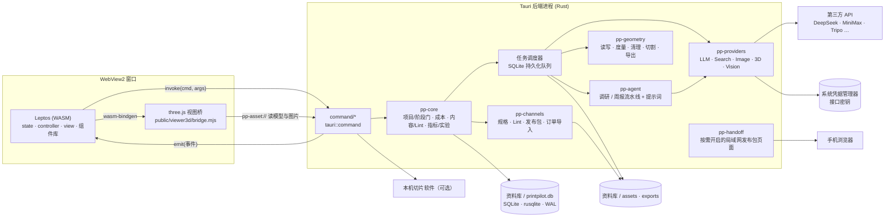
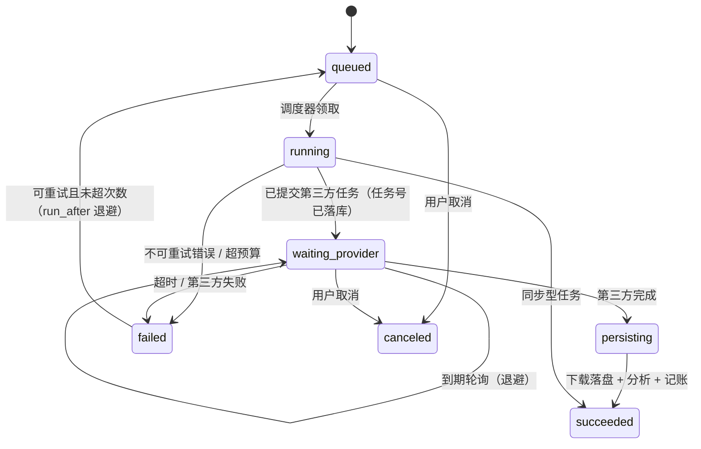
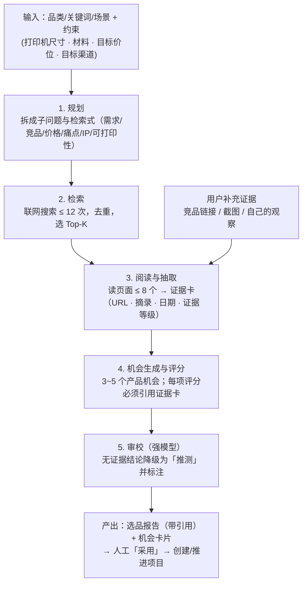
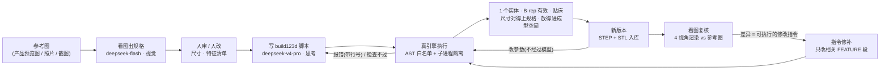
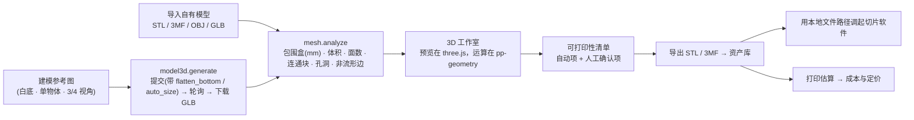
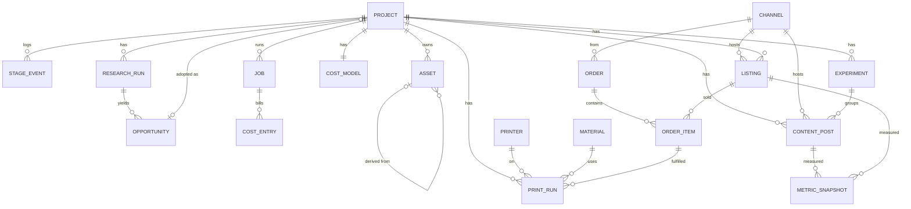

# 03 · 技术架构

> 状态：v0.2 设计稿（2026-09-20）· 选型依据与取舍见 [adr/0001-tech-stack.md](adr/0001-tech-stack.md)
> 读者：后续负责实现的开发者 / Claude Code 会话。产品需求见 [01-prd.md](01-prd.md)。
> 本工程与 `E:\velo`（ztmail）同栈，**凡是 velo 已有成熟做法的地方一律对齐 velo**，本文只写 PrintPilot 特有的部分和必须知道的约定。

## 1. 架构原则

| # | 原则 | 含义 |
|---|------|------|
| 1 | **流水线即产品** | 一个「项目」= 一个单品的全生命周期。所有数据（报告、图片、模型、文案、订单、指标）都挂在项目上并保留血缘，复盘时才能回答「什么有效」。 |
| 2 | **AI 起草，人拍板** | 所有 AI 产出都是候选，必须经人「采用」才进入下一阶段。任何对外动作（发布、改价、回复买家）都不自动执行。 |
| 3 | **供应商可替换** | LLM / 搜索 / 出图 / 3D / 渠道全部走 trait + 能力声明。模型名、域名、价格都是配置而不是常量——调研当天就发现 DeepSeek 换了模型命名、MiniMax 换了域名。 |
| 4 | **长任务持久化** | 调研、出图、3D 生成是 10 秒~10 分钟级任务，全部进 SQLite 持久化队列：可重试、可取消、可追踪成本；应用重启后接着跑，不重复扣费。 |
| 5 | **成本可见** | 每次 AI 调用都记账，汇总到项目级 P&L；单任务、单项目、月度三级预算闸门。 |
| 6 | **本地优先，零依赖** | 一个 exe 安装包；数据库静态编译进程序；数据全部在用户本机的「资料库」目录。领域逻辑放在与界面无关的 crate 里，将来要云端化只需外包一层服务。 |
| 7 | **只走合规通道** | 渠道接入只用官方 API / 官方导出 / 人工操作。不做模拟登录、爬虫、自动发帖、自动互动——账号是卖家的核心资产，平台已明确封禁 AI 全托管账号。 |

## 2. 总体架构



三条数据通路，全部沿用 velo 的做法：

| 通路 | 用途 | 约定 |
|------|------|------|
| `invoke` | 前端调后端 | 命令名集中在 `src/ipc.rs` 的 `cmd` 常量表；后端 `#[tauri::command(rename_all = "snake_case")]`；返回 `Result<T, String>`，错误串格式 `#错误码#细节`，前端按码本地化后弹 toast |
| `emit` / `listen` | 后端推前端 | kebab-case 事件名；并发任务用载荷里的 `req_id` / `job_id` 区分。PrintPilot 的事件：`job-changed`、`agent-chunk`（调研报告流式文本）、`asset-added`、`budget-warning`、`handoff-status` |
| `pp-asset://` | 本地文件进 WebView | 自注册异步 URI scheme（不用 `asset://`）。URL 里只带资产 ID，后端查库得到真实路径——天然杜绝路径穿越；支持 Range，方便加载几十 MB 的模型 |

## 3. 技术选型（结论）

| 层 | 选型 | 说明 |
|----|------|------|
| 壳 | Tauri 2（tauri-cli 2.10 系）· NSIS 安装包 · `installMode: currentUser` | 免 UAC；`embedBootstrapper` 处理 WebView2 缺失；`+crt-static` 不依赖 VC++ 运行库 |
| 前端 | Leptos 0.7（CSR）· Trunk 0.21 · Tailwind v4 · leptos_i18n 0.5 | 版本与 velo 保持一致，便于直接复制代码；Tailwind 由 Trunk 下载独立二进制，不需要 Node |
| 3D 渲染 | three.js，经 `wasm-bindgen` 的 JS 桥嵌入 | 照搬 velo 嵌 PDF.js 的模式；JS 只渲染不做 UI |
| 后端 | Rust · tokio · reqwest（rustls，支持代理）· serde | |
| 数据库 | SQLite：rusqlite（`bundled`）· WAL · 读写分连接 · `PRAGMA user_version` 线性迁移 | 与 velo 相同 |
| 密钥 | 系统凭据管理器（`CredentialStore` trait + keyring 实现 + 内存实现） | 与 velo 相同；条目名 `provider-key:{profile_id}` |
| 几何 | 原生 Rust：`gltf` / `stl_io` / `tobj` 读入，自研度量与基础清理，平面切割 + 截面封口，STL / 3MF 导出 | 只用 MIT / Apache / BSD / MPL 许可的依赖，不引入 GPL |
| 图像 | `image`（缩放、裁切 3:4、编码）+ 文字排版库做封面叠字 | 内置 1~2 款 OFL 开源中文字体，**不调用系统字体**（规避字体版权风险） |
| 表格导入 | `calamine`（读官方后台导出的 xlsx）· `csv` | |
| 局域网交接 | `axum` + `qrcode`，按需启动 | 见 §10 |
| 更新与日志 | tauri-plugin-updater（minisign，双端点）· tauri-plugin-log · single-instance · dialog · opener | 与 velo 相同 |

## 4. 代码结构

根包就是前端（与 velo 一致），后端在 `src-tauri`，共享与领域代码在 `crates/`。

```
printpilot/
├─ Cargo.toml                # 根包 = printpilot-ui（Leptos CSR）+ [workspace]
├─ Trunk.toml · index.html · tailwind.config.js
├─ .cargo/config.toml        # +crt-static；WASM 影子栈 8 MB（velo 教训）
├─ style/input.css           # Tailwind v4：@theme 品牌色、dark 变体
├─ locales/zh.json · en.json # zh 为默认；en 预留
├─ public/
│  ├─ viewer3d/              # three.js 视图桥：bridge.mjs + 预构建的 three 模块
│  └─ fonts/                 # 封面用开源字体
├─ src/                      # 前端（WASM）
│  ├─ main.rs                # 入口：按 ?win= 分派根组件；错误上报；启动耗时埋点
│  ├─ app/                   # App 根组件、事件监听注册、窗口
│  ├─ ipc.rs                 # cmd 常量表 + call / call_unit / fire / listen
│  ├─ state.rs               # AppState：Copy 的扁平结构体，字段全是 RwSignal
│  ├─ controller/            # 每个业务域一个 Copy 的 controller
│  ├─ ui/                    # ★ 组件库：Button / Field / Select / Dialog / Tabs / Card / Badge / Table / Toast
│  ├─ view/                  # board · project · research · images · studio3d · cost · publish · orders · analytics · settings
│  ├─ viewer3d.rs            # JS 桥的 wasm-bindgen 绑定
│  └─ theme.rs · icon.rs · i18n_util.rs · i18n_guard.rs · pointer_drag.rs · utils.rs
├─ src-tauri/
│  ├─ tauri.conf.json · capabilities/ · installer/hooks.nsh · icons/
│  └─ src/
│     ├─ lib.rs              # 装配：single_instance → URI scheme → manage → setup → plugins → invoke_handler
│     ├─ command/            # 每业务域一个文件：project / research / image / model3d / cost / publish / order / metric / settings / update
│     ├─ config_manager.rs · data_dir_wait.rs · proxy.rs
│     └─ scheduler.rs        # 任务调度器
├─ crates/
│  ├─ pp-common/             # 前后端共享：DTO、枚举、错误码、阶段定义（feature "backend"）
│  ├─ pp-db/                 # schema、迁移、仓储（trait + rusqlite 实现）
│  ├─ pp-core/               # 领域服务：阶段门、成本定价、内容与合规 Lint、指标、实验
│  ├─ pp-providers/          # 适配器 + 限速器 + mock
│  ├─ pp-agent/              # 调研 / 看图建模 / 周报流水线；prompts/*.md 经 include_str! 编入
│  ├─ pp-cad/                # 代码式 CAD：引擎定位、沙箱执行（py/runner.py）、参数解析与改写、代码契约（ADR-0003）
│  ├─ pp-channels/           # xhs / xianyu / wechat_shop
│  ├─ pp-geometry/           # 网格
│  └─ pp-handoff/            # 局域网发布包服务
├─ scripts/                  # build_release.ps1 · codesign.ps1 · stage-release.ps1 · publish-update.ps1 · cdp.py · i18n.py
└─ docs/ · CLAUDE.md
```

依赖方向：`src-tauri → pp-core → (pp-db, pp-providers, pp-agent, pp-channels, pp-geometry, pp-cad)`；`pp-agent` 只用 `pp-cad` 的纯文本部分（契约、参数）与错误类型，真正起 Python 进程的是 `src-tauri` 提供的 `CadExecutor`；所有 crate 都可以依赖 `pp-common`；`pp-providers` 与 `pp-channels` 不得反向依赖 `pp-core`。前端只依赖 `pp-common`（不开 `backend` feature）。

### 前端约定

- **状态**：`AppState` 是 `#[derive(Copy, Clone)]` 的扁平结构体，字段全是 `RwSignal<T>`，`provide_context` 一次、各处 `use_context`。因为是 `Copy`，闭包里直接 move。
- **协作**：view 只读信号、只调 controller 方法；controller 方法内 `spawn_local` → `ipc::call` → 写回信号。
- **组件库先行**：velo 的 `ui.rs` 很薄（按钮、对话框都是手写类串），这在表单密集的 PrintPilot 会很痛苦。第一周先把 `src/ui/` 建起来，之后的页面只许用组件、不许手写重复类串。
- **拖拽**：看板拖拽复用 `pointer_drag.rs`（指针事件 + `data-drop-stage` 属性 + 跟手浮标），不用 HTML5 DnD。
- **图表**：漏斗条、趋势线直接用 Leptos 输出 SVG，不引入图表库。
- **多窗口**：主窗口 + 可弹出的 3D 工作室（`index.html?win=studio&asset=<id>`）。每个窗口独立 `AppState`，跨窗口靠后端事件同步。

## 5. 适配器接口（关键抽象）

> 每个适配器声明 `capabilities`，界面与业务按能力降级，而不是写死某一家的特性。

```rust
#[async_trait]
pub trait LlmProvider: Send + Sync {
    fn capabilities(&self) -> LlmCapabilities;      // json_mode · tools · vision · reasoning
    async fn chat(&self, req: ChatRequest) -> Result<ChatResponse>;          // 带 usage，用于记账
    async fn chat_stream(&self, req: ChatRequest, sink: ChunkSink, cancel: CancelFlag) -> Result<ChatResponse>;
}

#[async_trait]
pub trait SearchProvider: Send + Sync {
    async fn search(&self, q: SearchQuery) -> Result<Vec<SearchHit>>;        // query · freshness · site · count
    async fn read(&self, url: &str) -> Result<PageContent>;                  // 不支持则返回 Unsupported
}

#[async_trait]
pub trait ImageProvider: Send + Sync {
    fn capabilities(&self) -> ImageCapabilities;    // text_to_image · edit · multi_ref · max_n · ratios · is_async · rpm
    async fn generate(&self, req: ImageGenRequest) -> Result<ProviderTask<Vec<ImageResult>>>;
    async fn edit(&self, req: ImageEditRequest) -> Result<ProviderTask<Vec<ImageResult>>>;
    async fn poll(&self, task_id: &str) -> Result<ProviderTask<Vec<ImageResult>>>;
}

#[async_trait]
pub trait Model3dProvider: Send + Sync {
    fn capabilities(&self) -> Model3dCapabilities;  // text/image/multiview · formats · geometry_only · flatten_bottom · auto_size
    async fn submit(&self, req: Model3dRequest) -> Result<String>;            // 供应商任务号：拿到即落库
    async fn poll(&self, task_id: &str) -> Result<ProviderTask<Model3dResult>>;
    async fn convert(&self, task_id: &str, format: MeshFormat) -> Result<String>;
}

pub trait ChannelAdapter: Send + Sync {
    fn capabilities(&self) -> ChannelCapabilities;
    //   publish_content: Manual | ShareSdk | Api      publish_listing: Manual | Api
    //   sync_orders:     None | File | Api            sync_metrics:    Manual | Screenshot | File | Api
    fn content_spec(&self) -> ContentSpec;          // 标题/正文/话题上限 · 图片比例与数量
    fn lint(&self, draft: &ContentDraft) -> Vec<LintIssue>;                  // 字数 · 违禁词 · IP 名词 · AI 声明提醒
    fn build_publish_pack(&self, draft: &ContentDraft, assets: &[AssetRef]) -> Result<PublishPack>;
    fn parse_orders_export(&self, bytes: &[u8]) -> Result<Vec<OrderDraft>>;  // 官方后台导出的订单表
}
```

`ProviderTask<T>` = `{ status: Queued | Running | Succeeded | Failed, progress, result, error, cost }`，同步型供应商直接返回 `Succeeded`。

**渠道能力降级**：`publish_content = Manual` 时，界面是「生成发布包 → 人工发布 → 回填链接」；将来某渠道变成 `Api`，同一个按钮变成「发布」，业务流程与数据结构不变。

**通用约束**（每个 HTTP 适配器都要做）：走应用统一的代理设置；超时与有限重试；按供应商限速（例：MiniMax 出图 RPM 仅 10）；域名与模型名来自配置；供应商返回的文件 URL 普遍 24 小时过期，**拿到结果立刻下载落盘**；流式响应按字节缓冲再切行（否则多字节汉字会被网络分块切坏）。

## 6. 任务系统



- **调度器**照搬 velo 的 `op_queue` 形态：单个分发循环，`tokio::select!` 在「mpsc 唤醒」和「睡到库里最近的 `run_after`」之间二选一；领到任务后 `spawn` 执行，受全局并发与每个供应商的并发 / 速率上限约束；状态变化才 `emit("job-changed")`。
- **任务类型**：`research.run` · `image.generate` · `image.edit` · `model3d.generate` · `model3d.convert` · `mesh.analyze` · `mesh.process` · `slice.estimate` · `content.generate` · `metrics.parse` · `review.weekly` · `radar.scan`。
- **崩溃与重启安全**：启动时把 `running` 且没有 `provider_task_id` 的任务退回 `queued`；已有任务号的恢复为 `waiting_provider` 继续轮询——**不会重复提交、不会重复扣费**。结果已过有效期则标记失败并提示重试。
- **幂等**：`dedupe_key = hash(type + 规范化输入)` 防连点；「重新生成」显式带随机数。
- **预算闸门**：入队前估算成本，超过「单任务 / 项目 / 月度」任一上限即拒绝并说明原因。
- **省钱调度**：可延后的批量任务（趋势雷达、周报）优先排到 DeepSeek 的空闲时段（价格减半）。
- **退出行为**：关闭主窗口时若有进行中的任务，提示「任务会在下次启动后继续」；MVP 不做托盘常驻。

## 7. 调研 Agent 编排

选择「有界流水线」而不是开放式 Agent 循环：步骤固定、每步有预算、产出有结构，质量稳定、成本可控、可回归测试。



- **模型分工**：步骤 1~4 用 `deepseek-flash`，步骤 5 用 `deepseek-v4-pro`；报告正文流式推到前端（`agent-chunk`）。
- **结构化输出**：DeepSeek 只有 `json_object` 模式、没有 JSON Schema → 每步的输出用 serde 反序列化进强类型结构并做业务校验，失败带着错误信息重试一次。
- **评分维度与权重**见 [05-growth-cro.md](05-growth-cro.md) §9；IP 与合规风险为「高」时一票否决。
- **证据等级**：A = 平台一手数据 / 用户上传截图；B = 媒体 / 博客 / 帖子；C = 模型推断。报告里 C 级结论必须显式标注「推测」。
- **已知边界**：搜索 API 搜不到小红书站内内容（robots 限制），所以「用户补充证据」不是可选装饰，而是调研质量的关键输入。没配搜索密钥时，流水线退化为「用户证据 + 模型知识」，报告顶部醒目标注。
- **提示词**放在 `crates/pp-agent/prompts/`，`include_str!` 编入；拼装顺序用单测锁定；每个模板配 3~5 个录制样例做回归。
- **经验回灌**：复盘沉淀的「经验库」条目注入规划与评分步骤的上下文——平台越用越准的飞轮。

## 8. 3D 管线

**两条建模路线，按造型分流**（决策见 [ADR-0003](adr/0003-code-cad-build123d.md)）：

| 路线 | 适合 | 产物 | 单个成本 | 局部修改 |
|------|------|------|----------|----------|
| **代码式 CAD（build123d，主路线）** | 收纳、支架、夹具、外壳、铭牌、几何风摆件——能用「草图 + 拉伸 / 旋转 + 布尔 + 圆角」描述的 | B-rep（STEP 为源头真值）+ 按精度现导的 STL / 3MF | ¥0.1 量级；改参数不花钱 | 参数面板（不经过模型）· 一句话指令（只改相关特征段）· 版本树 |
| AI 网格生成（Tripo 等，延后） | 人物、动物等有机造型 | 三角网格（GLB） | 约 ¥1.5 | 只能整体重生成，或在网格上做缩放 / 切平底 / 镜像 |

看图出规格这一步会判断造型适不适合代码式 CAD（`DesignSpec.suitable`）；不适合就如实告诉用户走网格路线，而不是硬生成一个四不像。两条路线的产物都是普通的模型资产，在 `mesh.analyze` 之后合流。

### 8.0 代码式 CAD 流水线



- 流水线在 `pp-agent::cad`（有界：第一版 + 最多 3 轮修复）；执行器通过 `CadExecutor` trait 注入，测试里用假的。
- 检查结果是带类型的 `CadProblem`：喂给模型用英文的 `for_model()`，给用户看由前端按 `kind` 本地化。
- 提示词里的 build123d 速查表与完整示例**逐条在真引擎上跑**（`crates/pp-cad/py/test_cheatsheet.py`）。
- 安全、引擎分发、实测数字见 ADR-0003。

### 8.0b 网格路线（延后）



### 8.1 视图桥（three.js）

照搬 velo 嵌 PDF.js 的模式：`#[wasm_bindgen(module = "/public/viewer3d/bridge.mjs")]`。**JS 只负责渲染**：Leptos 给出一个空容器的 id，JS 往里挂 canvas；工具栏、参数面板、主题、i18n 全在 Leptos；状态是 Leptos 的信号，JS 是被动执行者。three.js 用动态 `import()` 懒加载，主界面不为 3D 付加载成本；桥内资源一律写绝对路径 `/public/...`。

```
mount(containerId, opts) · dispose(containerId)
loadModel(containerId, url, format, keepView)  // url 为 pp-asset://<asset_id>；keepView：改参数后重载同一零件时不动镜头
setEdges(containerId, enabled)                 // 棱线叠加：CAD 零件的孔、槽、倒角靠它才看得清
setPickMode(containerId, enabled, handler)     // 点选 → {point, normal}（模型坐标，mm）；指令修补的定位线索
snapshotViews(containerId, size) → JPEG[4]     // 看图复核：等轴测 / 正 / 顶 / 右，白底带棱线，同步完成不闪屏
setDisplay(containerId, { mode, showBed, bedSize })   // 实体 / 线框；打印机成型范围参考框
setTransformPreview(containerId, { scale, rotation, mirror })
setCutPlanePreview(containerId, { enabled, height })  // 用 three.js 的裁剪平面做即时预览
pickFace(containerId, x, y) → 面法线           // 「以此面贴床」
snapshot(containerId) → PNG                    // 看板缩略图
```

**预览与落盘分离**：变换与切割在 three.js 里只是视觉预览；点击「应用」后由后端 `pp-geometry` 做真实运算、生成新的资产版本并重新分析，视图再加载新版本。几何逻辑因此全部是可单测的原生 Rust。

### 8.2 几何内核（pp-geometry）

| 阶段 | 能力 |
|------|------|
| MVP | 读入 GLB / STL / OBJ / 3MF；度量（包围盒、体积、表面积、面数、连通块、边界边、非流形边）；基础清理（焊接重复顶点、去退化面、去微小碎片、统一法线）；缩放到目标尺寸、贴床、镜像；**平面裁剪 + 截面封口**（保持水密）；导出二进制 STL 与 3MF |
| V1 | 小孔补洞；体素重建式修复；减面；文字浮雕 / 刻字（字体轮廓拉伸 + 布尔运算，候选：manifold 的 Rust 绑定，先做技术预研）；参数化模板 |
| V2 | 多色分件 |

- **估算**：`克数 ≈ (表面积 × 壁厚 + 内部体积 × 填充率) × 密度`，`时长 ≈ 克数 ÷ 每小时出料克数`；「每小时出料克数」用用户自己的打印记录自动校准。检测到切片软件时（V1）改用其命令行切片得到精确值（见 [04-integrations.md](04-integrations.md) §6.2）。
- **修复策略**：AI 生成的网格常常非流形。MVP 做到「检测 + 基础清理 + 明确提示」，重度问题交给切片软件导入时自带的修复；V1 再提供应用内一键修复。
- **FDM 优先**：不做抽壳（FDM 靠填充率）；单色为主，默认只向供应商要白模。
- **两条建模路线**：见本节开头。代码式 CAD 的 STL 同样是普通模型资产（入库时做一次网格分析写进 `meta_json`），本节的度量、估算、导出对它同样适用。

## 9. 数据模型

SQLite 约定：主键为 UUIDv7 文本；时间为毫秒整数；金额为整数「分」；灵活结构存 JSON 文本；软删除 `deleted_at`（为将来同步留余地）。一个资料库 = 一个数据库文件，因此不需要租户列。



| 表 | 关键字段（节选） | 说明 |
|----|------------------|------|
| `projects` | `code`(PP-0012) · `title` · `stage` · `status`(active/paused/killed/done) · `category` · `hypothesis` · `score_json` · `kill_reason` · `stage_entered_at` | `stage ∈ idea→research→concept→model→prototype→listing→operating→review` |
| `stage_events` | `from_stage` · `to_stage` · `actor`(user/agent) · `forced` · `note` | 用来算各阶段耗时与「想法→上架」周期 |
| `research_runs` / `opportunities` | `query` · `params_json` · `report_md` · `sources_json` · `scores_json` · `adopted_project_id` | 调研可不挂项目（灵感池） |
| `assets` | `kind`(image/model3d/doc/photo/video/pack) · `role`(concept_ref/concept_scene/cover/real_photo/model_raw/model_edited/print_file…) · `rel_path` · `meta_json` · `parent_asset_id` · `source_job_id` · `ai_generated` · `is_adopted` | **血缘**：图 → 模型 → 打印文件 → 封面全链路可追溯；`ai_generated` 驱动 AIGC 标识与发布提醒 |
| `jobs` | `type` · `provider` · `provider_task_id` · `status` · `input_json` · `output_json` · `error_code` · `attempts` · `run_after` · `dedupe_key` · `est_cost` · `cost` | 调度器直接读写这张表 |
| `cad_versions`（schema v2） | `parent_id` · `source`(manual/generate/param/edit) · `note` · `code` · `spec_json` · `ref_asset_ids_json` · `report_json` · `params_json` · `metrics_json` · `stl_asset_id` · `step_asset_id` | 代码式 CAD 的版本树：每次生成、改参数、指令修补、手写运行都是一个新版本；规格与参考图由子版本沿用（复核要用） |
| `cost_entries` | `category`(llm/search/image/model3d/material/shipping/fee…) · `amount` · `job_id` | 费用账本 → 项目 P&L |
| `printers` / `materials` | 成型尺寸 · 功率 · 购入价 · 寿命小时 · 实测每小时出料克数 / 类型 · 颜色 · 元每公斤 · 库存克数 | 成本模型与产能估算的基础数据 |
| `print_runs` | `est_minutes/grams` · `actual_minutes/grams` · `result` · `fail_reason` · `order_item_id?` | 打样与生产共用；失败率反哺成本，实际值反哺估算 |
| `cost_models` | 各成本项 · `platform_fee_rate` · `unit_cost` · `price_options_json` · `chosen_price` | |
| `channels` | `kind` · `capabilities_json` | 能力声明决定界面形态 |
| `listings` / `content_posts` | 商品草稿 / 笔记草稿：`angle` · `title` · `body` · `tags` · `cover_asset_id` · `variant_of` · `experiment_id` · `status` · `external_url` · `lint_json` | 变体与实验是一等公民 |
| `metric_snapshots` | `subject_type/id` · `captured_at` · `window`(T+1/T+3/T+7/T+30) · `metrics_json` · `source`(screenshot/file/api/manual) · `raw_asset_id` | 保留原始截图以便校对 |
| `orders` / `order_items` | `external_order_id` · `ship_by` · `status` · `customization_json` | **买家个人信息最小化**，见 §10 |
| `experiments` / `learnings` | 假设 · 变量 · 变体 · 主指标 · 结论 / 经验陈述 · 证据引用 · 置信度 | 复盘飞轮 |
| `meta` | 一次性数据迁移的完成标记 | velo 做法 |

**资料库目录**（位置由用户选择，可迁移；配置与指针文件的处理方式同 velo）：

```
<资料库>/
├─ printpilot.db (+ -wal / -shm)
├─ assets/<项目编号>/<asset_id>.<ext>
├─ thumbs/<asset_id>.webp
├─ exports/<项目编号>/<时间>-<渠道>/      # 发布包导出目录（给「在电脑上发布」用）
└─ backups/                               # 一键备份产物（zip）
```

## 10. 安全、隐私与合规落点

- **密钥**：只存系统凭据管理器；配置文件与前端永远拿不到明文，前端只知道 `has_key`；供应商 `base_url` 强制 https。
- **WebView**：CSP 以 velo 为基线，追加 `pp-asset:` / `http://pp-asset.localhost`（`img-src` 与 `connect-src`，three.js 用 fetch 取模型）和 `img-src blob:`（GLB 内嵌贴图）。`index.html` 不写内联 `<style>` 块。
- **局域网发布包页面**：只在用户打开发布包窗口时启动；随机端口 + 一次性令牌；只暴露当前这一个发布包的图片与文案；关闭窗口或 15 分钟无访问即停止。
- **买家个人信息（PIPL）**：只存履约必需字段；发货完成 N 天后自动脱敏；**任何买家个人信息不进入 LLM 上下文**（客服助手只拿商品 FAQ 与去标识化的问题文本）。定制类订单里的买家照片同理：调用第三方生成接口前需用户确认已获买家同意，任务完成后按设置自动清除原图。
- **AIGC 标识**：`ai_generated = true` 的图片导出时默认叠加显式标识（可关，关闭时提示用户自行承担标识义务）并写入隐式元数据；发布清单提醒勾选平台的 AI 内容声明；生成日志本地留存不少于 6 个月。细则见 [07-risks-compliance.md](07-risks-compliance.md)。
- **渠道红线**：适配器层不实现任何非官方自动化，代码评审把这一条当硬规则。

## 11. 打包、分发与更新

| 项 | 做法 |
|----|------|
| 安装包 | NSIS 单文件 `PrintPilot_x.y.z_x64-setup.exe`；`installMode: currentUser`（免管理员权限）；中英文界面；`hooks.nsh` 沿用 velo 的字体修正与卸载时数据目录处理（含「目录内必须有 printpilot.db 才允许删除」的硬护栏） |
| 零依赖 | SQLite 静态编译；`+crt-static`；WebView2 用 `embedBootstrapper`；另可出内嵌完整 WebView2 的离线版 |
| 代码签名 | 沿用 velo 的 `codesign.ps1` 流水线；NSIS 插件 DLL 也要补签；**更新签名必须对代码签名之后的文件计算** |
| 自动更新 | tauri-plugin-updater + minisign；新生成一对密钥；`latest.json` 双端点；**先传安装包后传清单**；服务器不得对清单返回 204；Windows 上安装后不调 `app.restart()` |
| 构建 | 发布：`trunk build --cargo-profile release`（不要 `--release`）；dev profile 不给 WASM 开 `opt-level`；`opt-level = "s"` + LTO + `codegen-units = 1` |

## 12. 质量保障

- **演示 / Mock 模式**：设置里一个开关，所有适配器返回内置样例（一份调研报告、4 张图、1 个 GLB）。用户没配密钥也能走完整条流水线；开发与端到端测试不花钱。
- **测试约定**（同 velo）：`#[cfg(test)] mod tests` 内联，文件过大用 `#[path]` 拆出；联网测试打 `#[ignore]`；适配器用录制回放的样例做契约测试；配置一致性单测（identifier、更新端点必须 https 等）；i18n 键对齐护栏。
- **几何回归**：一组固定的样例网格（水密 / 有洞 / 非流形 / 多连通块），断言度量结果与「切平底后仍水密」。
- **提示词回归**：每个模板 3~5 个录制样例，断言结构完整、引用存在、无违禁词。
- **打包版取证**：`scripts/cdp.py` 连 WebView2 的远程调试端口。velo 的教训是「dev 正常 ≠ 打包版正常」（CSP 只在打包版注入；WASM 栈溢出是 trap 不是 panic、不进日志）——**每个里程碑都要在打包版上走一遍黄金路径**。
- **前端错误上报**：`window.onerror` + `unhandledrejection` + panic hook → `fire(LOG_CLIENT_ERROR)` → 后端日志，带配额防刷屏。
