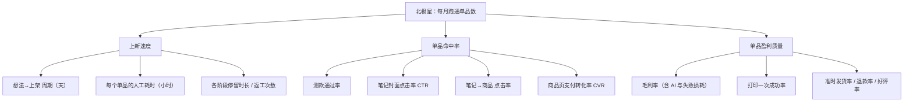

# 05 · 增长与转化率方案

> 状态：v0.1 设计稿（2026-09-20）
> 本文回答三个问题：**量什么**（指标体系）、**怎么拿到数**（数据回流）、**怎么把数变好**（杠杆、测款、实验、复盘）。
> 文中所有阈值都是**初始假设**，跑完前 10 个单品后用自己的数据重设——个人卖家拿不到可靠的类目基准，最靠谱的基线是「自己的中位数」。

## 1. 指标体系

### 1.1 北极星：每月「跑通单品」数

> **跑通单品** = 上架后 30 天内 **支付订单 ≥ 10**、**毛利率 ≥ 50%**、**退款率 ≤ 10%** 的单品。

它同时约束了「快」（上得多）和「准」（卖得动、赚得到），也不会被单个爆款或刷量掩盖。

### 1.2 指标树



### 1.3 90 天目标（自用阶段）

| 指标 | 基线（手工做） | 90 天目标 |
|------|----------------|-----------|
| 想法→上架 周期（中位数） | 1~2 周 | ≤ 3 天 |
| 每个单品人工耗时 | 8~15 小时 | ≤ 2 小时（不含打印等待） |
| 累计上架单品数 | — | ≥ 12 |
| 跑通单品数 | — | ≥ 3 |
| 每个想法的 AI 花费 | — | ≤ ¥10 |
| 每周录数耗时 | — | ≤ 10 分钟 |

## 2. 漏斗与数据回流

### 2.1 漏斗定义（以小红书为例）

```
笔记曝光 ──CTR──▶ 笔记阅读 ──互动率──▶ 赞/藏/评
                     │
                     └─商品点击率─▶ 商品访客 ──加购率──▶ 加购 ──▶ 支付订单 ──▶ 退款 / 评价
                                         └────────── 支付转化率 CVR ──────────┘
```

| 指标 | 公式 | 主要受什么影响 |
|------|------|----------------|
| CTR | 阅读 ÷ 曝光 | 封面、标题 |
| 收藏率 | 收藏 ÷ 阅读 | 内容价值、「想要」程度（测款核心指标） |
| 商品点击率 | 商品点击 ÷ 阅读 | 是否挂商品、正文引导、内容与商品的贴合度 |
| CVR | 支付买家 ÷ 商品访客 | 价格、主图、评价、发货时效、SKU 复杂度 |
| 退款率 | 退款单 ÷ 支付单 | 货不对板、质量、时效 |

### 2.2 数据怎么进来（按渠道能力自动降级）

| 来源 | 适用 | 做法 |
|------|------|------|
| API | 渠道开放了数据/订单接口且我们有资质 | 定时同步 |
| CSV | 官方后台支持导出 | 拖入文件 → 字段映射 → 入库 |
| **截图** | 只有后台页面、没有导出 | 截图 → 视觉模型识别 → 人工核对 → 入库（保留原图） |
| 手填 | 兜底 | 表单 |

**录数节奏**：每篇笔记在 T+1 / T+3 / T+7 / T+30 各一次快照，内容日历自动生成提醒；商品维度每周一次。

## 3. 转化率杠杆清单

> 排序依据：对个人卖家而言的「影响 × 可控性」。越靠前越优先做进产品。

| # | 阶段 | 杠杆 | 作用指标 | 平台如何支持 | 优先级 |
|---|------|------|----------|--------------|--------|
| 1 | 选品 | **选对品**：需求已被验证、竞争可避开、适合打印 | 全漏斗 | 调研 Agent 机会评分 + 证据卡 | P0 |
| 2 | 概念 | **先测款再投入**：用场景图验证「想要」 | 命中率 | 测款 SOP + 互动阈值判定 | P0 |
| 3 | 上架 | **封面与标题**：3:4 大字封面、搜索词进标题 | CTR | 封面模板叠字 + 多变体 + 关键词建议 | P0 |
| 4 | 上架 | **真实感**：实拍 + 打印过程 + 上手尺寸参照；如实展示层纹与颜色 | CVR、退款率 | 实拍图清单；首图强制实拍；AI 只用于非首图的背景（主体像素不变），不做批量换景 | P0 |
| 5 | 定价 | **价格锚定与尾数**：成本底线 + 竞品价格带 + 三档建议价 | CVR、毛利 | 成本定价器 | P0 |
| 6 | 商品 | **个性化定制**（刻字/配色/尺寸）：3D 打印独有的溢价点 | CVR、客单价 | V1 参数化模板 + 订单定制字段 → 自动出打印文件 | P1 |
| 7 | 运营 | **响应速度**：咨询 5 分钟内回复 | CVR | 客服回复建议（基于商品 FAQ） | P1 |
| 8 | 运营 | **发货时效承诺清晰且做得到** | CVR、退款率 | 产能测算 → 建议承诺时效；打印队列按发货截止排序 | P1 |
| 9 | 内容 | **同一单品多角度持续发**：过程型/痛点型/场景型/定制故事型 | 曝光、CTR | 内容日历 + 多角度文案生成 | P1 |
| 10 | 商品 | **SKU 做减法**：颜色 ≤ 4，默认项清晰 | CVR | 上架检查清单 | P2 |
| 11 | 复购 | **套装/系列化**：跑通的单品延伸同系列 | 客单价、复购 | 复盘页「放大」建议 | P2 |
| 12 | 口碑 | **买家秀**：随包裹卡片邀请分享（**不做好评返现**，属平台违规） | CVR | 包装卡片模板 | P2 |

## 4. 测款 SOP（概念图烟雾测试）

**目的**：在建模、打样之前，用 1 小时和几块钱判断「有没有人想要」。

1. 选 1 张场景效果图 + 1~2 张细节/配色图，写一篇「设计征集意见」型笔记（哪个配色好 / 你会用在哪）。
2. **如实表述**：明确这是设计稿 / 打样中；AI 生成图按平台要求做 AI 内容声明；不挂可立即购买的商品链接，避免货不对板与虚假宣传。
3. 观察 72 小时，录入 T+1 / T+3 数据。
4. 判定（初始阈值）：

| 条件 | 结论 |
|------|------|
| 阅读 ≥ 300 且 收藏率 ≥ 5% 且 意向评论（求链接/多少钱/怎么买）≥ 5 | ✅ 通过 → 进入建模 |
| 阅读 ≥ 300 但互动不达标 | ❌ 淘汰或换概念；记录原因进经验库 |
| 阅读 < 300 | ⚠ 样本不足：换封面/标题重发一次，或用官方加热工具小额补量后再判 |

5. 通过的笔记别浪费：上架后在评论区置顶购买方式，把早期意向用户接住。

## 5. 实验框架

个人店流量小，**不追求统计显著，追求方向正确和持续积累**。

- **一次只动一个变量**：封面 / 标题 / 首图 / 价格 / 内容角度。
- **模板**：`假设`（因为…所以…）→ `变体` → `主指标` → `观察窗`（默认 7 天）→ `结论` → `沉淀为经验`。
- **判定规则**：两个变体各自曝光 ≥ 1,000，且主指标相差 ≥ 30% 才下结论；否则记为「无结论」，不硬解读。
- **排期优先级**用 ICE（影响 × 信心 × 容易度）。
- **避免重复内容**：平台会对高度雷同的笔记限流。封面实验用「不同角度的两篇笔记」而不是同文双发；价格实验按周切换而不是同时两价。
- **经验库**：每个有结论的实验沉淀一句话经验（例：「桌搭类：前后对比封面 CTR 高于单品特写」），带证据引用与置信度，后续会自动注入调研评分与文案生成的上下文。

## 6. 内容策略

| 角度 | 说明 | 适合阶段 |
|------|------|----------|
| 设计幕后型 | 「从一张图到实物」：概念图 → 3D 模型 → 打印 → 成品，流水线本身就是内容 | 测款、上新 |
| 过程型 | 打印延时摄影、拆支撑、上色——解压且建立真实感 | 上新、日常 |
| 痛点型 | 使用前后对比 | 转化 |
| 场景型 | 桌搭 / 房间 / 礼物场景 | 种草 |
| 定制故事型 | 一位买家的定制需求与成品（需脱敏并获同意） | 转化、口碑 |
| 清单型 | 「5 个 3D 打印桌面好物」，带出自家多个单品 | 拉新、系列化 |

**节奏**：每个新单品上架前两周 ≥ 3 篇不同角度；账号整体每周 3~5 篇。
**搜索优化**：调研阶段沉淀的搜索词进入标题前 10 个字、正文首段与话题。
**合规 Lint**（发布前自动检查）：极限词、医疗/功效宣称、IP 名词、AI 内容声明提醒、平台字数与图片规格。

## 7. 定价策略

1. **成本底线**：单位成本含材料损耗、失败率摊销、电费折旧、人工、包装、运费补贴（公式见 [01-prd.md](01-prd.md) M4）。
2. **三档建议价**：按目标毛利 50% / 60% / 65% 反推，落到 9.9 / 5.9 这类尾数；与调研得到的竞品价格带并排展示。
3. **不打价格战**：同质化严重时，出路是原创设计、系列化、个性化定制，而不是降价——个人卖家的产能决定了走不了薄利多销。
4. **产能约束入价**：单机日产能 × 毛利 = 每天能赚的上限。打印时间长的单品必须有更高的单件毛利，否则不值得占机时（成本定价器会显示「每机时毛利」）。

## 8. 复盘节奏

| 频率 | 做什么 | 平台支持 |
|------|--------|----------|
| 每天 5 分钟 | 看工作台：待发货、打印队列、到期的录数提醒 | 工作台待办 |
| 每周 30 分钟 | 每个在售单品：漏斗对比自己的基线 → 选 1~2 个实验 | 周报 Agent 自动起草诊断与实验建议 |
| 每月 | 单品去留（放大 / 迭代 / 淘汰）；回看北极星；调整评分权重与阈值 | 单品对比视图 + 经验库 |

**诊断规则（初始版，周报 Agent 使用）**

| 现象 | 优先怀疑 | 建议动作 |
|------|----------|----------|
| CTR 低于自己中位数的 70% | 封面/标题 | 换封面形式、标题加搜索词 |
| CTR 正常，商品点击率低 | 内容与商品脱节 / 未挂商品 / 引导弱 | 调整正文结构与引导、评论区置顶 |
| 商品访客正常，CVR 低 | 价格、主图、评价、发货时效、SKU 过多 | 价格实验、补实拍与尺寸参照、SKU 减法 |
| CVR 正常，退款率高 | 货不对板、质量、时效 | 主图去滤镜化、补充尺寸/材质说明、检查打印质量 |
| 全部健康 | — | 放大：多角度内容、加配色、做系列、考虑加机器 |

## 9. 机会评分默认权重

| 维度 | 权重 | 说明 |
|------|------|------|
| 需求热度 | 25% | 搜索/讨论/同类销量的证据强度 |
| 差异化与定制潜力 | 15% | 能否靠原创设计或个性化避开同质化 |
| 竞争强度（反向） | 15% | 同款数量、头部集中度、价格战程度 |
| 可打印性 | 15% | 尺寸、支撑、一次成功率预期、后处理量 |
| 毛利空间 | 15% | 价格带 vs. 预估单位成本，及每机时毛利 |
| IP 与合规风险（反向） | 10% | **高风险一票否决**，不参与加权 |
| 物流友好度 | 5% | 易碎、体积、重量 |
