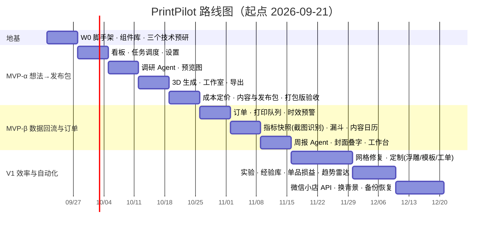

# 06 · 路线图与里程碑

> 状态：v0.1（2026-09-20）· 周数按「一名开发者 + Claude Code」估算，技术栈为 Rust + Tauri 2 + Leptos（对齐 velo）。
> 原则：**每个里程碑的出口标准都是业务结果**（真的用它卖出了东西），而不是功能清单打勾。

## 1. 总览

| 里程碑 | 周期 | 主题 | 出口标准 |
|--------|------|------|----------|
| **W0** | 第 1 周 | 地基与预研 | 签名安装包可装、可自动更新；三个技术预研通过或已确定备选 |
| **MVP-α** | 第 2~5 周 | 想法 → 发布包 | 用它完整走通 **3 个真实单品**；想法→发布包 ≤ 1 天；每个想法 AI 花费 ≤ ¥10 |
| **MVP-β** | 第 6~8 周 | 数据回流与订单 | 3 个单品在售且漏斗有数；无超时发货；每周录数 ≤ 10 分钟；周报可用 |
| **V1** | 第 9~13 周 | 效率与自动化 | 想法→上架中位数 ≤ 3 天；≥ 1 个定制类单品跑通；5~10 位外部卖家内测 |
| **V2** | 之后 | 规模化 | 多色分件、打印机状态、产能外包；评估官方中转额度与收费 |

## 2. W0 · 地基与预研（第 1 周）

**脚手架（从 velo 复制，copy-and-own）**
Cargo workspace 与 `.cargo/config.toml`（`+crt-static`、WASM 栈 8 MB）· Trunk + Tailwind v4 · `ipc.rs` 常量表与调用助手 · `AppState` 模式 · 主题 / 图标 / toast / 右键菜单 · i18n（zh + en）与护栏 · `config_manager` 与数据目录逻辑 · `CredentialStore` · rusqlite 基座与 `user_version` 迁移 · 日志与前端错误上报 · updater · NSIS `hooks.nsh` · 发布脚本（新生成一对 minisign 密钥，更新端点另起）。

**组件库 `src/ui/`**
Button · Field · Select · Dialog · Tabs · Card · Badge · Table · Toast · EmptyState。之后的页面只许用组件。

**三个技术预研（各带通过标准）**

| 预研 | 通过标准 | 不通过时的备选 |
|------|----------|----------------|
| ① three.js 视图桥 | 在**打包版**里经 `pp-asset://` 加载 50 MB 的 GLB，交互 ≥ 30 fps，CSP 无告警；裁剪平面预览可用 | 纯 Rust 渲染 `three-d` |
| ② 几何内核 | 3 个真实的 AI 生成模型：读入 → 度量 → 切平底并封口 → 导出 STL，Bambu Studio / OrcaSlicer 里能直接切片，尺寸误差 < 0.1 mm | 切平底改用供应商的 `flatten_bottom`；封口算法换用 manifold 绑定 |
| ③ 调研流水线 | DeepSeek `json_object` + 搜索适配器跑通「规划 → 检索 → 抽取 → 评分」，单次 < ¥1、< 5 分钟，结构化输出失败率 < 5% | 换模型 / 拆小步骤 |

## 3. MVP-α 任务拆解（第 2~5 周）

| 周 | 交付 | 要点 |
|----|------|------|
| 2 | 数据层全量建表；项目看板（指针拖拽）；项目详情骨架与阶段门；任务调度器（持久化、限速、预算闸门、重启恢复）；设置（密钥预设与测试连接、打印机 / 耗材、预算、代理、演示模式） | 演示模式从第一天就有——之后所有界面都能不花钱地开发与验收 |
| 3 | 调研 Agent（流水线、流式报告、证据卡、机会卡、采用为项目、用户补充证据）；预览图：**图片工作台已完成**（一级入口 + 对话式出图 / 改图，MiniMax + 通义千问图像，见 ADR-0005）——剩下真密钥实测、调规划提示词、封面模板叠字、从模型渲染图出场景图 | 提示词带回归样例 |
| 4 | 3D：**建模工作室**（一级入口 + 对话式修改已完成，见 ADR-0004）接进项目的「模型」阶段——产品预览图直接作参考图、真模型实测并调提示词、引擎包下载（常驻引擎进程已在 W0 完成：改参数 0.2~0.3 秒）；导入自有模型；可打印性清单；调起切片软件；体积法估算。Tripo 适配器延后到有机造型需求出现时 | 预览与落盘分离；生成的代码只在沙箱里跑 |
| 5 | 成本定价器（含渠道费率预设、每机时毛利）；商品与笔记草稿生成；合规 Lint；发布包（电脑端 + 手机扫码）；回填链接；**打包版黄金路径验收** | 从扫码 / 打开到发布完成 ≤ 2 分钟实测 |

## 4. 与开发并行的业务准备（负责人）

| 事项 | 何时需要 |
|------|----------|
| 注册并充值：DeepSeek（调研 + 看图建模都用它）、智谱（搜索）、MiniMax；Tripo 等到要做有机造型时再开 | W0 结束前 |
| ~~定下建模引擎包的托管位置~~ 已定（2026-09-20）：不另外托管，压成一个文件打进安装包（ADR-0003「引擎的分发」） | — |
| 代码签名证书（Windows）与 Apple Developer ID（macOS 签名 + 公证）——没有的话用户首次打开会看到系统警告 | 对外分发之前 |
| 小红书个人店开通（或确认现有店铺主体与店铺分） | MVP-α 结束前 |
| 选定首批 3 个品类方向（建议：桌面 / 家居小件 + 可定制小物） | 第 3 周调研 Agent 可用时 |
| 拍摄环境（小灯箱 / 背景布 / 尺寸参照物） | 第 4 周打样时 |
| 是否办理个体工商户执照（决定 V1 的微信小店渠道） | MVP-β 期间决定 |
| 确认产品名、发行主体、更新服务器域名 | W0 |

## 5. 发布标准（每个里程碑都要过）

1. 打包版（不是 dev）走通黄金路径，用 `scripts/cdp.py` 确认无未捕获异常。
2. 安装包已代码签名；从上一个版本自动更新成功；卸载不误删资料库。
3. 无阻断级缺陷；已知问题写进发布说明。
4. 文档同步：PRD 范围变化、ADR、用户可见变化的发布说明。
5. 依赖许可证检查通过。

## 6. 预算估算

| 项 | 估算 |
|----|------|
| 开发期接口费用 | 约 ¥200 / 月（有演示模式，大部分开发不花钱） |
| 每个单品的 AI 成本 | 约 ¥6（调研 0.7 + 出图 0.8 + 3D 约 4 + 文案 0.1）；止步于调研的想法 < ¥1 |
| 基础设施 | 代码签名与更新服务器沿用 velo 现有设施 |

## 7. 节奏

- 每周一次：对照 [05-growth-cro.md](05-growth-cro.md) 的输入指标看一眼——想法→上架周期、每单品人工耗时、AI 花费。
- 每个里程碑结束：回看 PRD 的优先级，允许把 P1 / P2 互换，但出口标准不降。
- 任何改变范围或技术方向的决定：写一条 ADR。
