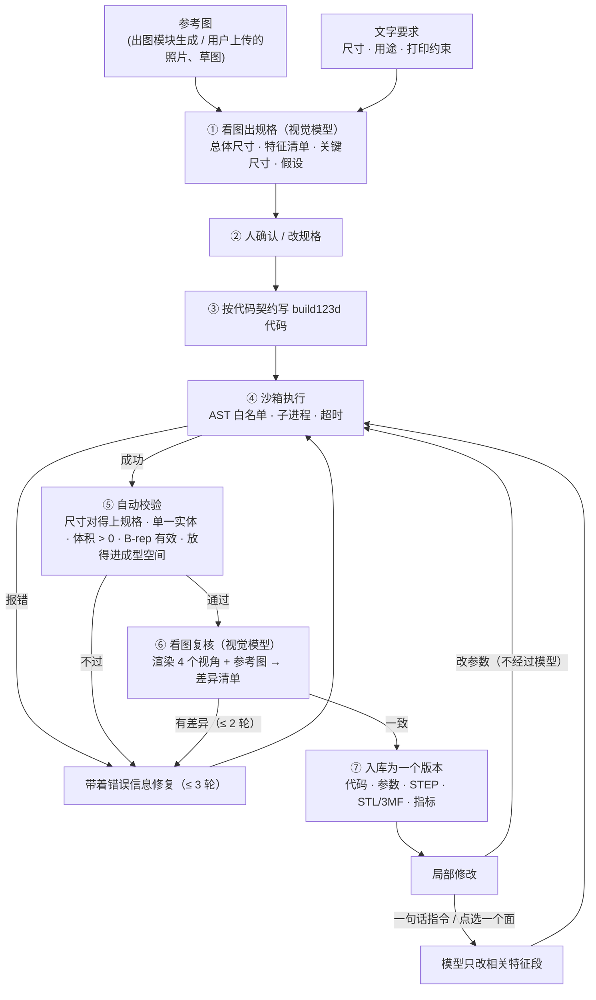

# ADR-0003 · 建模主路线：图片 → build123d 代码式 CAD（可局部修改）

- 状态：**已采纳**（2026-09-20，负责人指定为当前最高优先级）
- 影响：[01-prd.md](../01-prd.md) M3、[03-architecture.md](../03-architecture.md) §8、[06-roadmap.md](../06-roadmap.md)

## 背景

原设计的建模主路线是「图生 3D 网格」（Tripo 等）。它有三个硬伤，恰好都打在我们的目标上：

| 硬伤 | 后果 |
|------|------|
| 产出是三角网格，没有尺寸语义 | 做不了尺寸精确的功能件；「孔改大 2 mm」无从下手 |
| **不能局部修改**，只能整体重新生成 | 每次修改都是抽奖，且要重新花钱（约 ¥1.5 / 次） |
| 网格常常非流形、无平底 | 还要修复才能打印 |

而调研的结论是：同质化摆件在打价格战，**个性化定制与功能件**才有溢价——这正是参数化 CAD 的主场。

[build123d](https://github.com/gumyr/build123d)（Apache-2.0，基于 OpenCascade）是 Python 的代码式 CAD：模型 = 一段带参数的代码，产出是精确的 B-rep 实体，可导出 STEP / STL / 3MF。DeepSeek 的 `deepseek-flash` 已支持视觉输入。两者结合，就能做「看图 → 写代码 → 出模型」，而且模型天然可编辑。

## 决定

1. **build123d 代码式 CAD 成为建模主路线**；图生 3D 网格降为「有机 / 装饰造型」的补充路线，延后接入。
2. 流水线采用「先规格、后代码、执行即校验、看图再复核」，见下。
3. 「局部修改」用两种机制实现：**参数面板**（不经过模型，改数字即重算）与**指令修补**（模型只改相关的特征段）。
4. build123d 需要 Python 与 OpenCascade，体积约数百 MB。为守住「单个 exe 安装包、用户零手动安装」的约束，采用**引擎包**：一个预制的、可重定位的 CPython + build123d，压成**一个文件打进安装包**；应用第一次用到代码建模时校验并解到应用数据目录（不联网）。开发阶段用 `scripts/setup-cad-engine.ps1` 建一个私有虚拟环境代替。（2026-09-20 负责人拍板：不另找地方托管，就是单个安装包——见「引擎的分发」。）

## 流水线



### 「高质量」靠什么

| 手段 | 作用 |
|------|------|
| 先规格后代码 | 把「看图理解」和「写代码」拆开：规格可以给人看、给人改，代码生成有明确的尺寸依据 |
| 代码契约（见下） | 参数集中、特征分段、结果变量固定——可解析、可局部修改、可回归 |
| 执行—修复循环 | 模型写的 CAD 代码首次常常跑不通（选边失败、圆角过大）；把 traceback 喂回去，通常 1~2 轮修好 |
| 自动校验 | 尺寸偏离规格、多个散件、无效实体，都在入库前拦住 |
| 看图复核 | 让视觉模型对比渲染图与参考图，找出漏掉的特征 |
| B-rep 为准 | STEP 是源头真值；网格按需要的精度现导（线性 0.01 mm、角度 0.1 rad 起），不存在「模型糊」的问题 |

### 代码契约

```python
from build123d import *

# ---- PARAMS ----  每行一个:名字 = 数值  # 单位 | 说明 | [最小, 最大]
width = 60.0        # mm | 总宽 | [20, 200]
hole_d = 4.2        # mm | 安装孔直径 | [2, 10]

# ---- FEATURE: base ----
base = Box(width, 40, 6)

# ---- FEATURE: mounting_holes ----
holes = ...

# ---- RESULT ----
result = base - holes
```

- `PARAMS` 段由应用解析成参数面板；改参数 = 改这一行的数字后重跑，不调用模型。
- 每个特征一段，段名即特征名；「指令修补」时要求模型只动相关的段，界面上显示差异。
- 必须有 `result`（Part / Solid / Compound）；导出由执行器统一做，**生成的代码里不允许出现任何文件读写**。

### 局部修改

| 方式 | 经过模型 | 适用 |
|------|----------|------|
| 参数面板 | 否 | 改尺寸、数量、角度——最常见、最可靠、零成本 |
| 一句话指令 | 是（只改相关特征段） | 「顶边加 1 mm 圆角」「加两个挂孔」「底座加厚」 |
| 点选 + 指令 | 是 | 在 3D 视图里点一个面，面的位置与法线作为定位线索传给模型 |
| 版本树 | — | 每次修改是一个新版本（父子关系），可回退、可分叉 |

## 安全：执行模型生成的代码

这是在用户机器上执行不可信代码，按纵深防御处理：

1. **AST 白名单**（执行器内，运行前）：只允许导入 `build123d` 与 `math`；禁止 `eval / exec / open / __import__ / getattr` 等内建；禁止任何双下划线属性访问；禁止 build123d 自带的文件读写（`export_*`、`import_*`、`Mesher` 等）——这些名字不放进执行命名空间，并在 AST 层拦截同名属性调用。
2. **进程隔离**：独立子进程（`python -I -B`），临时工作目录，最小化环境变量（**不含任何接口密钥**），超时即杀。
   引擎进程是**常驻**的（`runner.py --serve`，省掉每次约 4 秒的冷启动），隔离措施与单次执行完全相同，另外保证任务之间不串味：每个任务全新的命名空间；AST 层**禁止给属性赋值**（`Box.x = …`、`math.pi = 3` 这类对共享对象的改动会留到下一个任务）；`math` 每任务发一份替身；跑满 40 个任务换新进程；超时直接杀进程、下次再起；stdin 一关（应用退出）进程自己退出，另有进程内看门狗兜底。常驻进程起不来时自动退回单次执行。
3. 输出只认执行器写的 `result.json` 与导出文件。
4. 后续加固：Windows Job Object（禁止子进程、限内存）与受限令牌。

残余风险：白名单不是形式化沙箱。缓解：代码在执行前对用户可见；执行环境里没有密钥；后续上 OS 级沙箱。

## 引擎的分发

build123d 0.12 依赖 cadquery-ocp、numpy、scipy、scikit-learn 等，装好后是数百 MB 量级。

| 方案 | 用户体验 | 代价 |
|------|----------|------|
| **A. 打进主安装包（采纳，2026-09-20）** | 一个安装包，装完即用，离线可用，不依赖任何下载源 | 安装包从约 5 MB 变成约 230 MB；将来做自动更新时每次都要重下一遍（到时候可以出「只含应用」的增量包） |
| B. 引擎包按需下载 | 主安装包仍是几 MB | 需要一个公开的托管位置（私有仓库的 Release 附件外部下载不了）；首次使用要联网，国内从 GitHub 下 200 MB 很不稳 |
| C. 另出「完整版」安装包（A 与 B 并存） | 离线环境可用 | 多维护一个产物 |
| D. 改用 replicad（OpenCascade 的 WASM 版，跑在 WebView 里） | 真正零依赖、几十 MB | 模型对它的 API 远不如对 build123d 熟，生成质量差；生态小 |

**许可证**（对照 CLAUDE.md 硬约束 6）：build123d 与 cadquery-ocp 的绑定层是 Apache-2.0；numpy / scipy / scikit-learn 是 BSD；lib3mf 是 BSD-2；底下的 OpenCascade 内核是 LGPL-2.1（附例外条款）。引擎是一个**独立下载、独立进程**的组件——我们的可执行文件不链接它，通过「写 job.json → 起子进程 → 读 result.json」交互，所以不触碰「不在进程内链接 (L)GPL 库」这条线。引擎包里要原样带上各组件的许可证文本；发布引擎包之前请负责人再过一遍各依赖的许可证清单（接入前待核实）。

采纳 A；D 留作后手。

**怎么打进去**：不是把两万多个散文件塞进安装包，而是**一个** `cad-engine.tar.zst`（Tauri 的 `bundle.resources`）+ 一份清单（版本、SHA-256）。理由：安装过程快（一个文件 vs 2.3 万个）；macOS 上 Python 的二进制不待在签名的 `.app` 里（否则公证要逐个签）；校验、解包、换版本是同一段可测试的代码（`src-tauri/src/engine_pack.rs`）。

| 环节 | 做法 |
|------|------|
| 构建 | `scripts/build-engine-pack.py`：python-build-standalone 的可重定位 CPython 3.12（**按 SHA-256 钉死**）+ `pip install -c scripts/engine/constraints.txt build123d==0.12.0`（版本锁 = 开发机上跑通全部测试的那个环境）→ 去掉 pip 与启动器脚本 → **用即将发出去的这个解释器跑一遍执行器测试和提示词速查表测试（37 个）** → 预编译字节码（`unchecked-hash`，冷启动更快）→ 确定性的 tar → zstd -19 |
| 大小（Windows x64 实测） | 22,956 个文件，740 MB → **224 MB** |
| 首次使用 | 面板发现「带着引擎包、但数据目录里解开的不是这个版本」→ 自动开始：校验 SHA-256 → 解到 `cad-engine/.incoming-*` → 原子换名成 `cad-engine/python/`。不用用户点、不联网；进度条走事件。调试构建里实测 77 秒（发布构建更快） |
| 升级 | 清单里的 `engine_version` 变了才重装；应用怎么升级都不会白白重解一遍 |
| 安全 | tar 里的路径必须落在 `python/` 下（相对、无 `..`），符号链接不许指到包外；校验不过一个字节都不解；中途失败只会留下 `.incoming-*`，下次清掉，已装好的引擎不受影响 |
| 教训 | 不要删 numpy / scipy 自带的测试目录来省空间：`numpy.testing` 会 import `numpy._core.tests`，而 scipy 经 `from numpy import *` 把它带进来——第一次构建就是这样把 `import build123d` 弄坏的，好在打包前的测试拦住了 |

## 实现状态（2026-09-20）

整条链路已经实现，并在开发版应用里端到端跑通（演示模式：假模型 + **真引擎**）。

| 环节 | 落在哪 | 怎么验证的 |
|------|--------|------------|
| 执行器（AST 白名单 + 受限命名空间 + 统一导出 + 常驻模式） | `crates/pp-cad/py/runner.py` | 19 个 Python 单测；`import os` 在 validate 阶段被拒并报行号；常驻模式下连续 6 个任务互不影响、前一个任务的变量后一个看不到、stdin 一关进程退出 |
| 进程隔离（清环境、临时目录、超时即杀、stderr 落文件） | `crates/pp-cad/src/run.rs`（单次）· `worker.rs`（常驻） | 真引擎测试：死循环 → `Timeout` 且进程被杀；出错的任务不影响后面的任务；环境里没有密钥 |
| 参数解析 / 改写、代码契约、改动段比对 | `pp-cad/src/{params,contract}.rs` | 改 `width` 只有 X 变、面数不变；`changed_sections` 精确到段 |
| 看图出规格、生成、指令修补、看图复核 | `crates/pp-agent/src/cad.rs` + `prompts/cad_*.md` | 23 个流水线测试（脚本化假模型 + 假执行器） |
| 提示词里的 build123d 速查表与完整示例 | `prompts/cad_code.md` | **逐条在真引擎上跑**（`py/test_cheatsheet.py`，18 个）——速查表写错一个名字，模型就会照着错 |
| 后端命令、版本库、资产入库、费用记账 | `src-tauri/src/command/cad.rs`、`pp-db`（schema v2 `cad_versions`） | 演示脚本过真流水线：第一版故意写坏 → OpenCascade 真实报错（带行号）→ 第二版修好 |
| 面板 | `src/view/lab/cad/` | CDP 驱动真实界面：出规格 → 生成 → 改参数 → 点选 + 指令修改 → 看图复核 → 导出 STEP / STL / 3MF |

### 流水线里落实的几条规矩

- **两个模型分工**：看图只能用 `deepseek-flash`（DeepSeek 唯一支持视觉的模型），写代码用 `deepseek-v4-pro` 开思考——它看不见图，只看人审过的规格。
- **检查带类型**：`CadProblem`（`kind` + 数字）而不是一句话。喂给模型用 `for_model()`（英文，和提示词一致），给用户看由前端按 `kind` 本地化。
- **跑通 ≠ 合格**：恰好 1 个实体、B-rep 有效、贴床（|z_min| ≤ 0.01）、包围盒与规格相差不超过 max(1 mm, 5%)（高度必须对上，X / Y 允许互换）、放得进成型空间、PARAMS 可解析且当前值在自己声明的范围内。
- **契约问题和运行错误同一轮一起报**，少来回一次模型调用。
- **只差「没贴床」时不找模型**：自动补一行 `result = Pos(0, 0, -result.bounding_box().min.Z) * result`（用包围盒现算，改参数后仍成立），并在报告里注明。
- **修复次数用完**：交付「问题最少的那一版」并把遗留问题列给用户；一版能跑的都没有时，把最后一版代码放进代码框、每一轮的报错摆出来——用户可以接着手改，而不是只看到一句「失败」。
- **中途的供应商故障**（限流、断网）不让已经建成的版本作废。
- **指令修补**：整份脚本 + 段名清单 + 指令（+ 点选的坐标与法线）交给模型，要求其余逐字保留；交回没改动的代码直接打回、不浪费一次引擎执行；改了哪些段由我们比对得出（`changed_sections`），不信模型自述。修补不拿旧规格的尺寸去卡它。
- **参考图入库**：按 EXIF 摆正 → 最长边缩到 1536 → 透明底铺白 → 重编码 JPEG。重编码顺带去掉了 EXIF（GPS、机型）——这张图要发给第三方模型。
- **看图复核**：前端同步截 4 个视角（等轴测 / 正 / 顶 / 右，白底、带棱线、768 px，实测 32 ms），每条差异写成可直接执行的修改指令，界面上「按此修改」一键交给指令修补。

### 实测数字（本机，build123d 0.12.0 / Python 3.10）

| 项 | 单次执行（冷启动） | **常驻进程（现状）** |
|----|--------------------|----------------------|
| 一次引擎执行（三槽线缆夹，导出 STEP + STL） | 3.7 ~ 4.2 s，其中约 4 s 是起进程 + `import build123d` | **0.09 ~ 0.22 s** |
| 演示生成（2 次模型应答 + 2 次执行，含一轮真实报错修复） | 8.5 ~ 9.8 s | **0.35 s** |
| 改一个参数 → 新版本入库（网格分析 + 两个资产 + 版本）→ 视图刷新 | 4.8 s | **0.19 ~ 0.30 s** |
| 常驻进程就绪（面板打开时顺带完成，取代原来的引擎探测） | — | 约 4 s，一次 |

导出物：STEP 124 KB · STL 55 KB · 3MF 10 KB。看图复核的 4 张截图 32 ms。

### 下一步

1. ~~常驻工作进程~~ **已完成**（见上表）。后续可做：滑块拖动过程中做低精度预览（现在是松手才重建）。
2. **真模型实测**：首轮通过率、平均修复轮数、单模型成本与耗时（需要负责人的 DeepSeek 密钥；密钥只经设置页进系统凭据管理器）。
3. ~~引擎包~~ **已完成**（方案 A：随安装包自带，首次使用自动解开）。后续可做：设置页里的「重装 / 卸载引擎」入口。
4. OS 级沙箱加固：Windows Job Object（禁子进程、限内存）。
5. 面板从预研页搬进项目的「模型」阶段（版本挂到项目上，产品预览图直接作为参考图）。

## 影响

- 成本：看图出规格 + 写代码一轮约几千 token，**单个模型的 AI 成本从约 ¥1.5（网格生成）降到 ¥0.1 以内**，且改参数不花钱。
- 能力边界：适合能用「草图 + 拉伸 / 旋转 / 扫掠 + 布尔 + 圆角」描述的零件（收纳、支架、铭牌、外壳、夹具、几何风摆件）；不适合人物、动物这类有机造型——那部分仍走网格路线。
- 路线图：MVP-α 第 4 周的「3D」改为以本路线为主；Tripo 适配器延后。
- 新增代码：`crates/pp-cad`（引擎定位、执行、参数解析与修补）、`pp-agent` 的建模流水线、`pp-providers` 的视觉输入、预研页的「代码建模」面板。
